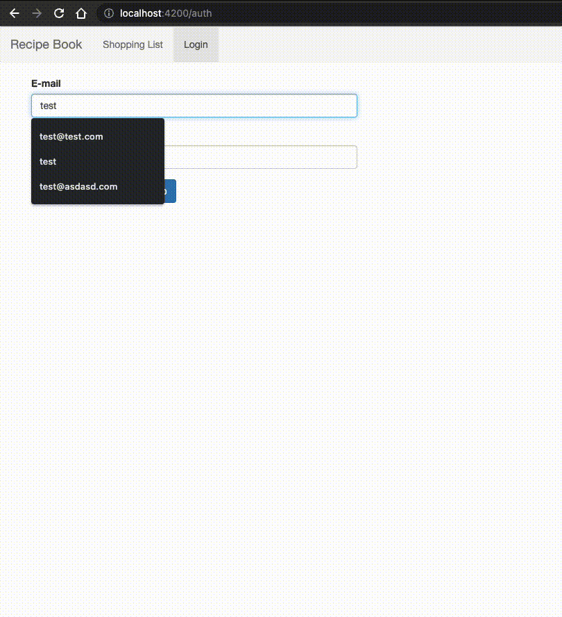

# Recipe App Angular

This recipe application shows some basic *Angular features* implementations. This was based on the  [Angular the complete guide - Maximilian Schwarzmüller](https://www.udemy.com/course/the-complete-guide-to-angular-2/) course

## Features
- Angular features (Services, Components, Pipes, etc)
- API Calls
- Storage
- Firebase (Authentication, RealTime DB, Hosting)
- NgRx

## Demo

